# Creature Forge

A generative creature editor for the low-poly era — Spyro and Crash, flat shading
and vertex colours, no textures anywhere. It runs entirely in the browser.

Creature editors hide their machinery and show you a creature. This one draws the
machinery **on** the creature, live, while it walks.

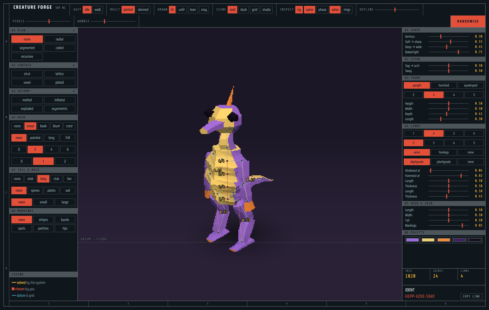

Vite, TypeScript and Three.js. No UI framework — the interface is a drafting
sheet, and the controls are built from the same tables that drive the generator,
so a control cannot exist in the panel and go missing from the model.

## The inspect layer

Five lenses draw the live system over the animating creature. This is the point
of the project, not a debug mode bolted on afterwards.

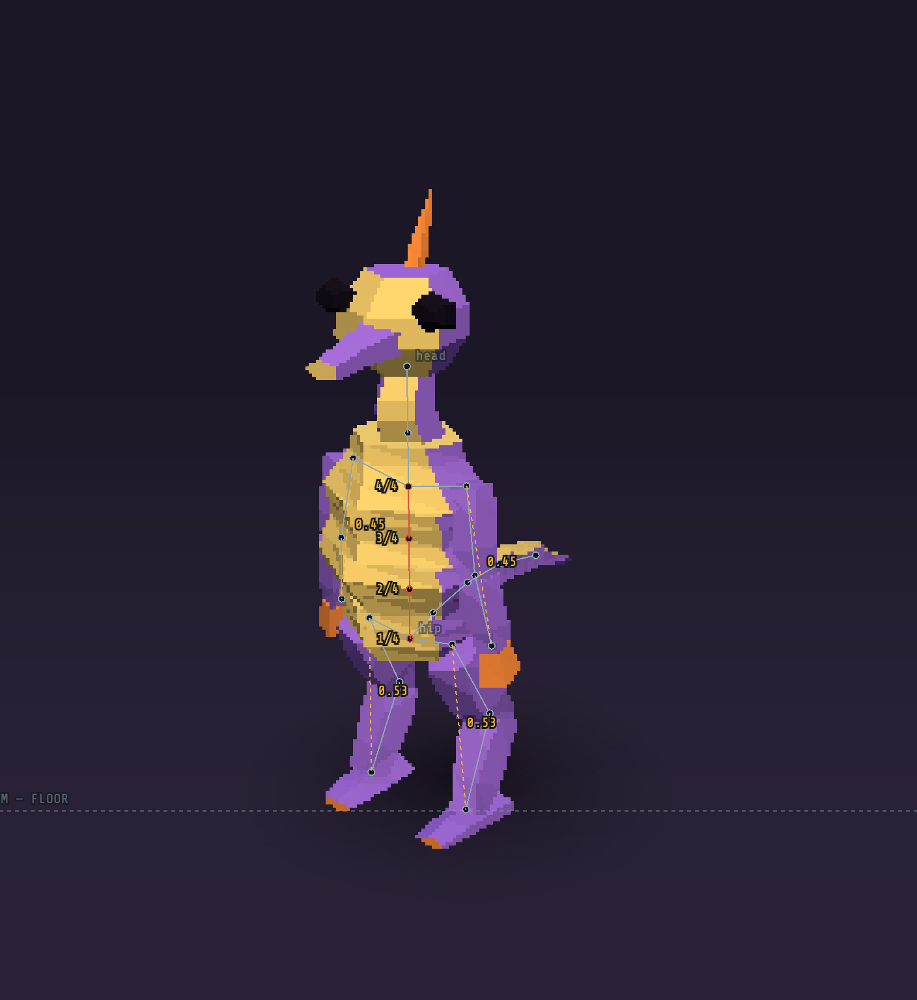

| Lens | What it draws |
| --- | --- |
| **rig** | The bone tree as it actually exists, joint by joint |
| **spine** | The bead chain the body is built along, numbered |
| **phase** | Each limb's offset in the gait cycle |
| **solve** | The floor solve measuring its own reach, and the datum it lands on |
| **rings** | The cross-section rings the surface was sampled from |

The lenses also appear on their own when you touch a control: hovering a spine
slider draws the spine, hovering a limb slider draws the solve. Each control
declares which part of the machinery it is about, so the sheet annotates itself
and goes quiet again when you let go.

Three inks carry meaning and nothing is decoration: **solved** is what the
generator worked out, **chosen** is what you picked, **datum** is the floor and
the structure underneath.

## Structure, not decoration

Twelve mutations change how a creature is *put together* — its symmetry, its
topology, what its surface is made of — rather than bolting another part onto
the same body plan.

<table>
  <tr>
    <td align="center">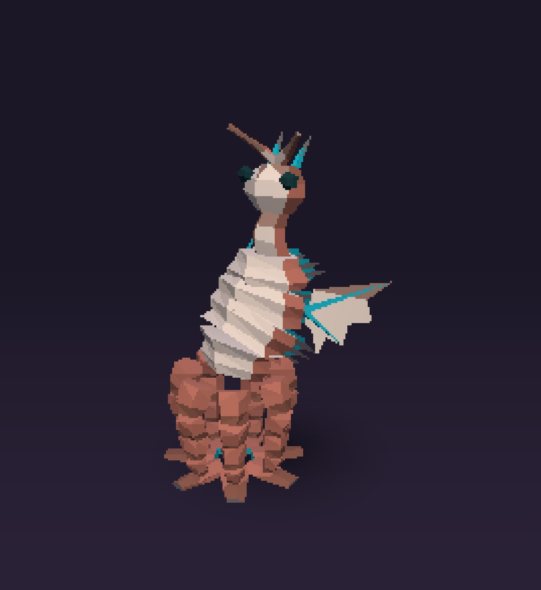<br><sub><b>radial</b> — bilateral pairs become a ring</sub></td>
    <td align="center">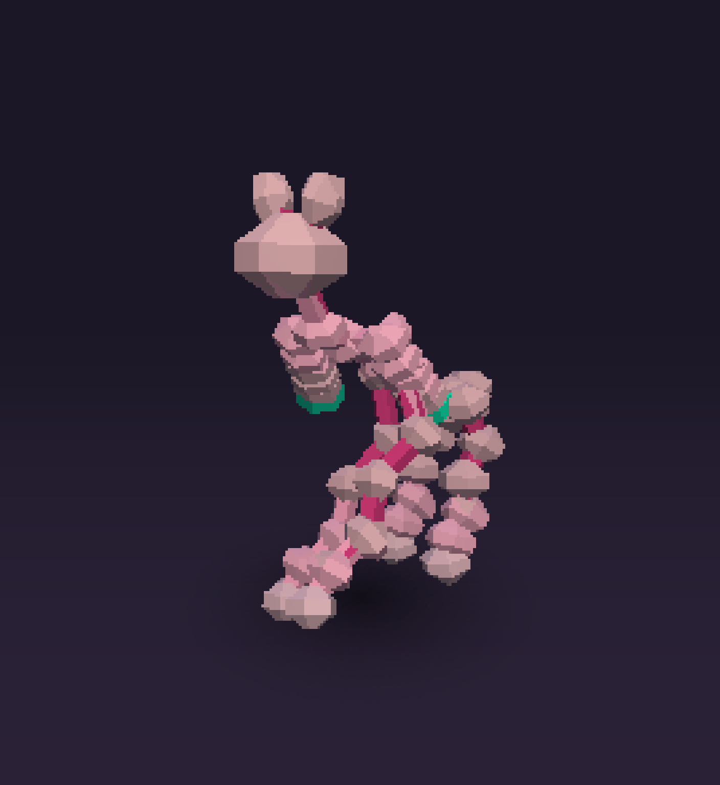<br><sub><b>strut</b> — the armature is the creature</sub></td>
    <td align="center">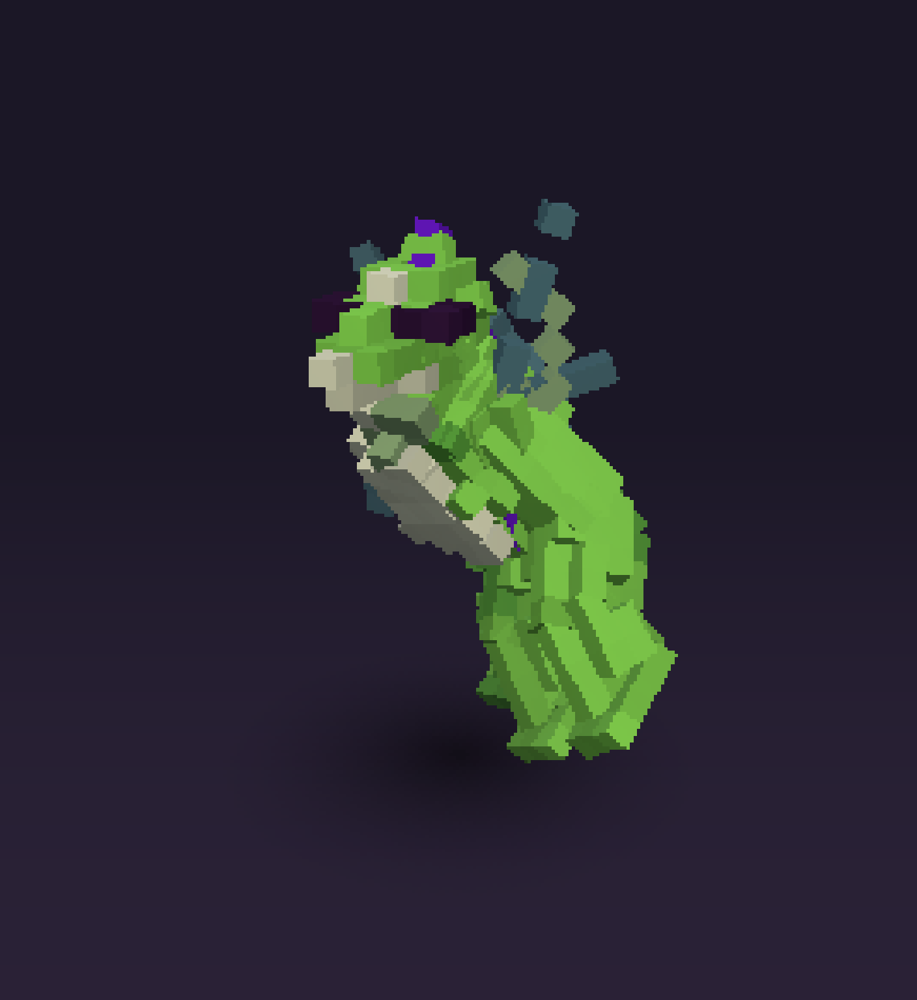<br><sub><b>voxel</b> — the surface requantised onto a grid</sub></td>
  </tr>
  <tr>
    <td align="center">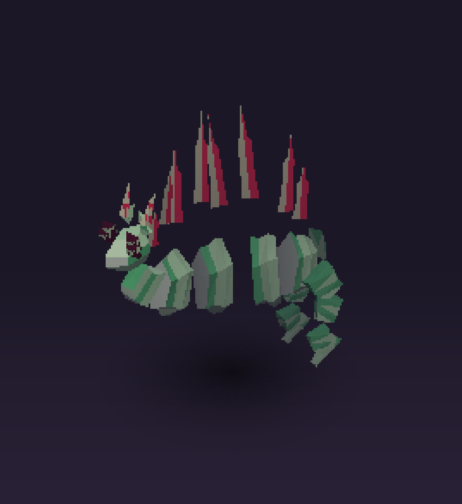<br><sub><b>exploded</b> — the assembly, not the animal</sub></td>
    <td align="center">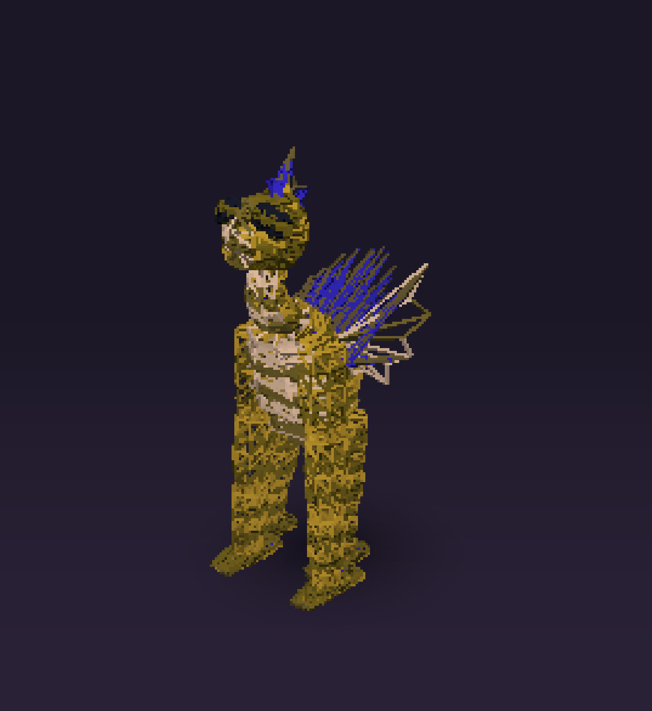<br><sub><b>lattice</b> — every edge becomes a strut</sub></td>
    <td align="center">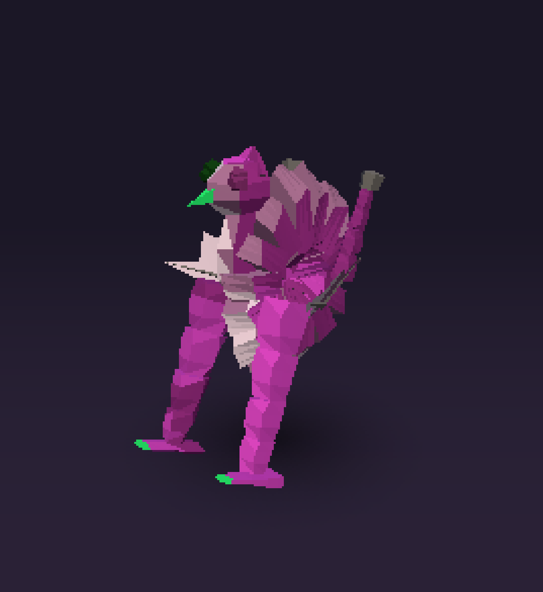<br><sub><b>coiled</b> — the spine wound a full turn</sub></td>
  </tr>
</table>

Every one of them has to survive every body plan. A radial creature whose
four-bone limbs ring its body still walks, because **the gaits are never told
what they are animating** — limbs register themselves with a kind and a phase,
and the animator only ever reads that registry. No gait names a joint.

## How it's drawn

<table>
  <tr>
    <td align="center">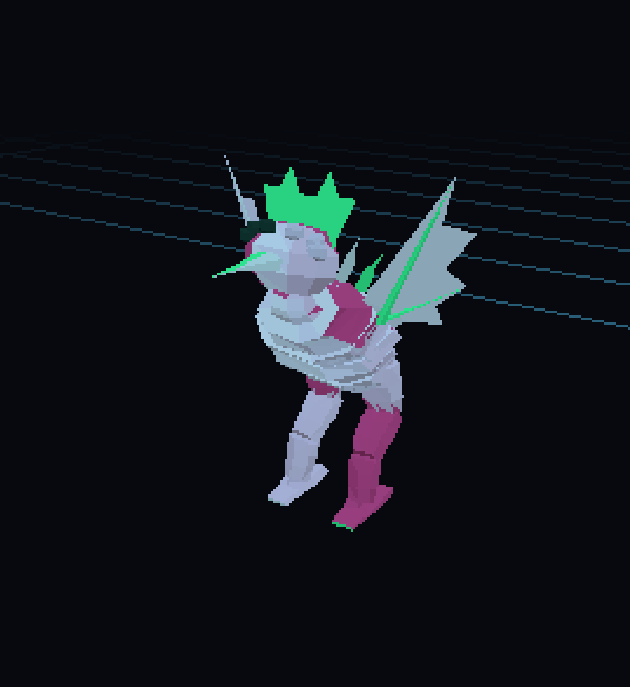<br><sub><b>toon</b> on the grid</sub></td>
    <td align="center">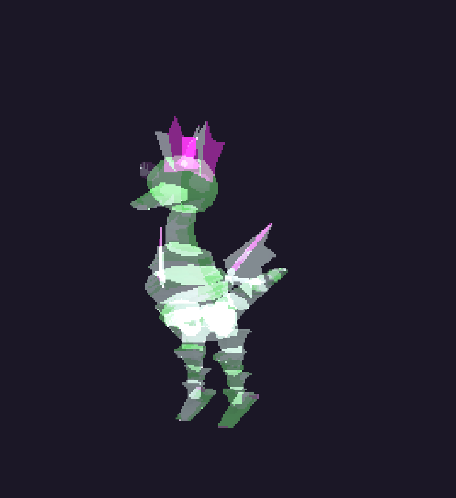<br><sub><b>xray</b> on a skinned mesh</sub></td>
    <td align="center">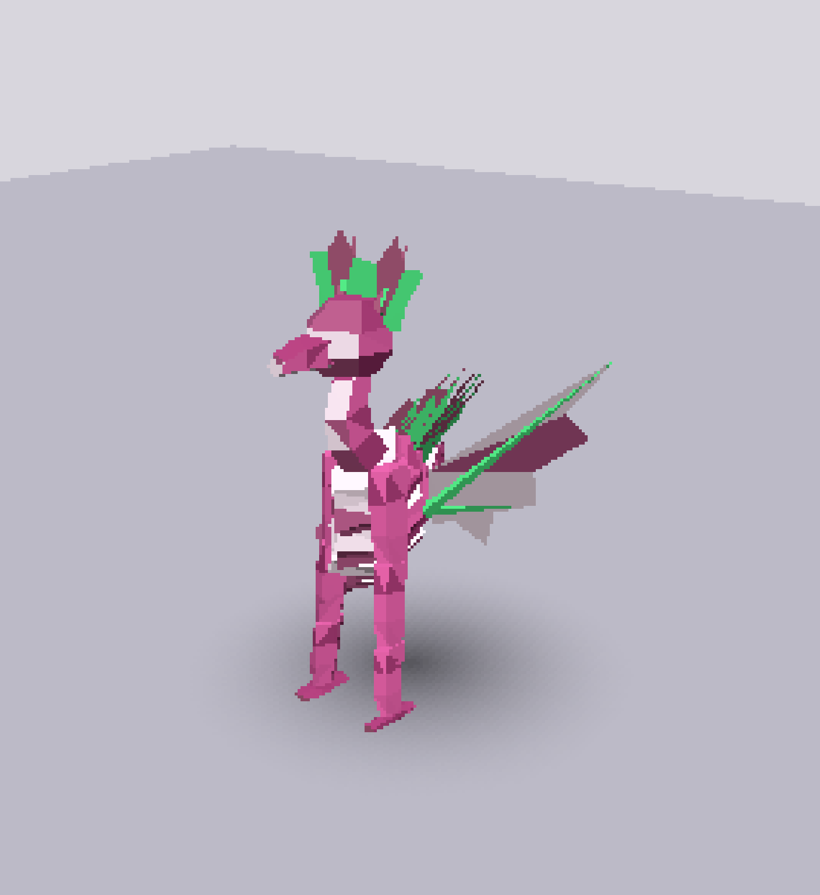<br><sub><b>studio</b>, outline at 0.75</sub></td>
  </tr>
</table>

The era look is reproduced rather than filtered: a low-resolution drawing buffer
upscaled with nearest-neighbour, vertex positions snapped to a coarse grid in
clip space (PS1 hardware had no sub-pixel precision in its rasteriser, which is
the single most recognisable tell of the period), flat shading, inverted-hull
outlines, and light baked into vertex colours. **Pixels** and **wobble** are
dials rather than constants, because the whole point of the era look is being
able to take it too far.

One slider slides the same silhouette from **288 to 4,012 triangles** by changing
how densely the profile curves are sampled, without changing the shape.

## A creature is a link

Everything the sheet holds — the creature *and* how it is being looked at —
packs into one bitstream and rides in the address bar:

```
creature-forge/#2002MA107HQ5N5NACHJ3RS34CHJ68PK4B84A8S34K9NE1W6GEBR8MF1V45G183RW00PK87GN6
```

73 characters, Crockford base32 (no `I`, `L`, `O` or `U`, so it survives being
read aloud), with a ten-bit checksum — a mistyped character gives you the default
creature rather than a plausibly wrong one. Open a link and you get the scene it
stood in and the lenses that were lit. **Every screenshot above was taken from
its own share code.**

The field table is generated from the same lists that build the controls, so a
slider cannot exist in the panel and go missing from the code. A version nibble
covers the rest: change those lists and the layout changes, and an older code is
refused rather than misread.

## Running it

```sh
npm install
npm run dev      # vite, port 5173
npm test         # vitest, 393 tests
npm run build    # typechecks first, then builds
```

## How it fits together

```
src/
├── spec.ts        the creature as plain serialisable data; clamping and rolling
├── share.ts       spec + view ⇄ one base32 code, and the drawing number
├── geometry.ts    prisms from stacked cross-sections; superellipse profiles
├── parts.ts       every body part as a profile function
├── joints.ts      the joint tree primitives everything else is hung from
├── generate.ts    spec → a joint tree of meshes, and the limb registry
├── mutate.ts      the structural mutations, applied to a built creature
├── pattern.ts     markings painted from the creature's own geometry
├── skin.ts        bind-pose bake and the weld that makes one continuous mesh
├── animate.ts     joints + time + gait → rotations, morphology-blind
├── inspect.ts     the five lenses, projected to a pooled SVG overlay
├── shade.ts       baked vertex light and the blob shadow
├── render.ts      the viewport, the era pipeline, scenery and materials
├── density.ts     rails that measure themselves and pick a level that fits
├── ui.ts          the sheet, built from the spec's own tables
└── main.ts        composition root: reads the address bar, wires the rest
```

Two decisions carry most of the weight. **The spec is plain data** — no classes,
no Three.js types — so it can be hashed, clamped, rolled, diffed and encoded
without touching the renderer. And **the limb registry** is what lets gaits stay
morphology-blind, which is Spore's hard problem in miniature.

The tests are mostly measurements rather than assertions about implementation:
that every mutation still leaves a creature standing on the floor, that a
sagging spine keeps its mass over its own feet, that a creature carries enough
value to read against the ground it stands on, that no combination of parts
produces a NaN vertex.

## Documents

- [`PRODUCT.md`](PRODUCT.md) — who it is for, what is deliberately undecided, and
  what is missing and known to be missing
- [`.impeccable/surfaces/app.md`](.impeccable/surfaces/app.md) — the direction
  contract the interface is built against

## Known gaps

No `.glb` export yet — a creature can leave as a link but not as a file. No undo,
and no way to lock part of a creature and reroll the rest. The camera fits an
axis-aligned box rather than the projected silhouette, so a creature sits smaller
in frame than it needs to.
